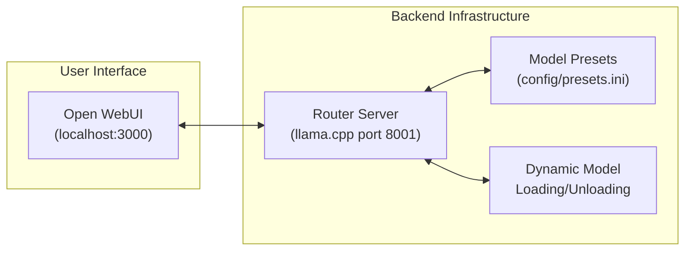

# Ullama

> Version-controlled infrastructure-as-code and reference for local LLM deployment with CUDA acceleration.

[](https://www.cachyos.org)
[](https://developer.nvidia.com/cuda-toolkit)
[](https://github.com/ggml-org/llama.cpp)

## Overview

Ullama serves as a personal infrastructure-as-code (IaC) repository to persist and version control a complete local LLM setup. It is intended to act as a reference for deploying various open-source models on NVIDIA GPU hardware by combining llama.cpp with CUDA support, a router-server for dynamic model management, and Open WebUI for an accessible chat interface.

### Features

- **GPU Acceleration** - Full CUDA support via llama.cpp
- **Open WebUI** - Familiar ChatGPT-like interface
- **Router Server** - Dynamic model loading/unloading with preset-based configuration
- **Multiple Models** - Support for Qwen, Gemma, NVIDIA Nemotron, GLM, and more
- **Easy Updates** - Scripts to keep llama.cpp current
- **Efficient Memory** - KV cache quantization and MoE optimization

## Quick Start

### Prerequisites

- CachyOS or Arch Linux (other distros may work)
- NVIDIA GPU with CUDA support (RTX 3090/4090 recommended)
- Minimum 16GB VRAM for larger models
- 32GB+ system RAM

# Ullama
...
### Installation

```bash
# 1. Install Docker
# Note: If docker is not installed, use the manual install-docker.sh script first.
# Once installed, log out and back in, then:

# 2. Start Open WebUI
make docker-up

# 3. Build llama.cpp (if not already done)
make build

# 4. Start the router server
make server
```
...
### View Logs

```bash
# Router server logs
tail -f scripts/logs/server.log

# Open WebUI logs
make docker-logs

# Monitor GPU usage
watch nvidia-smi
```
...
### Restart Services

```bash
# Restart router server
make stop
make server

# Restart Open WebUI
make docker-down
make docker-up
```

...
### View Logs

```bash
# Router server logs
tail -f scripts/logs/server.log

# Open WebUI logs
make docker-logs

# Monitor GPU usage
watch nvidia-smi
```
...
### Restart Services

```bash
# Restart router server
make stop
make server

# Restart Open WebUI
make docker-down
make docker-up
```
...


### Access

Open your browser at **http://localhost:3000** to start chatting. The router server will automatically load models based on your requests.

### Remote Server Access (Advanced)

For running the server on a remote machine (e.g., `jupiter`) while accessing from your local machine, see the [Remote Server Access documentation](scripts/README.md#advanced-remote-server-access-temporary-solution).

> **Note:** This is a temporary workaround until the systemd service implementation is complete. See [`docs/specs/systemd-plan.md`](docs/specs/systemd-plan.md).

## Available Models

Models are configured via preset files (`config/presets.ini` for Linux, `config/presets-macos.ini` for macOS). The router server automatically manages model loading based on requests.

### Qwen Models (Alibaba)

| Model | Quantization | Context | Notes |
|-------|--------------|---------|-------|
| Qwen3.5-122B-A10B | UD-Q4_K_XL | 65K/131K/262K | MoE (10B active), multiple context variants |
| Qwen3.5-35B-A3B | UD-Q4_K_XL | 131K | MoE (3B active) |
| Qwen3.5-27B | UD-Q4_K_XL | 131K | Dense model |
| Qwen3.5-27B Claude-Opus Reasoning | Q4_K_M | 131K | Reasoning-distilled variant |
| Qwen3.5-9B | UD-Q8_K_XL | 131K | Dense model, high quality |
| Qwen3-Coder-Next | Q4_K_XL | 262K | Specialized coding model |

### Gemma Models (Google)

| Model | Quantization | Context | Notes |
|-------|--------------|---------|-------|
| Gemma-4-31B | UD-Q3_K_XL | 65K | Dense multimodal |
| Gemma-4-26B-A4B | UD-Q4_K_XL | 32K | MoE (3.8B active), multimodal |

### NVIDIA Nemotron Models

| Model | Quantization | Context | Notes |
|-------|--------------|---------|-------|
| Nemotron-3-Super-120B-A12B | UD-Q4_K_XL/UD-Q3_K_XL | 32K/131K | MoE (12B active) |
| Nemotron-3-Nano-30B-A3B | Q4_K_XL | 64K | MoE (3B active), CPU expert routing |

### GLM Models (Zhipu AI)

| Model | Quantization | Context | Notes |
|-------|--------------|---------|-------|
| GLM-4.7-Flash | Q8_K_XL | 131K | MoE (23B total, 3B active) |
| GLM-4.7-Flash-REAP | Q4_K_XL | 16K | REAP variant |
| GLM-4.5-Air | Q5_K_XL | 16K | Lightweight variant |

### Other Models

| Model | Provider | Quantization | Context | Notes |
|-------|----------|--------------|---------|-------|
| MiniMax-M2.5 | MiniMax | IQ2_XXS | 16K | MoE with CPU expert routing |
| Devstral-Small-2-24B | Mistral | Q4_K_XL | 65K | Instruction-tuned |
| Step-3.5-Flash | Step | IQ3_XXS | 262K | Large context |
| OmniCoder-9B | Tesslate | Q8_0 | 262K | Coding-focused |
| gpt-oss-120B | Unsloth | F16 | 32K | Open-source GPT-style |

See [`config/presets.ini`](config/presets.ini) for the complete configuration.

## Architecture

Ullama uses a router-server pattern for efficient model management:



### How It Works

1. **Open WebUI** connects to the router server at `http://localhost:8001/v1`
2. **Router Server** reads model configurations from preset files
3. **Dynamic Loading**: Only one model is loaded in VRAM at a time (`--models-max 1`)
4. **Preset-Based**: Models are configured via `.ini` files with optimized parameters

## Configuration

### Docker Compose

The `docker-compose.yaml` configures Open WebUI to connect to the router server:

```yaml
services:
    openwebui:
        image: ghcr.io/open-webui/open-webui:main
        ports:
            - "3000:8080"
        environment:
            - OPENAI_API_BASE_URL=http://host.docker.internal:8001/v1
```

### Router Server

The `run-server.sh` script starts the router with preset-based model management:

```bash
#!/usr/bin/env bash
set -euo pipefail

# Router Configuration
ROUTER_ARGS=(
    --models-preset "$PRESET_FILE"
    --models-max 1           # Only one model in VRAM at a time
    --port 8001              # OpenAI-compatible API port
    --log-file "$LOG_FILE"
    --log-colors off
)

# CPU affinity for optimal performance (Linux only)
CMD_PREFIX="taskset -c 0-7"

$CMD_PREFIX llama-server "${ROUTER_ARGS[@]}"
```

### Model Presets

Presets are configured in INI format. Each model is a section with optimized parameters:

```ini
# Global defaults
[*]
port = 8001
flash-attn = on
jinja = true
threads = 8
threads-batch = 16
cache-type-k = q8_0
cache-type-v = q8_0
fit = on

# Individual model configuration
[unsloth/Qwen3-Coder-Next]
hf = unsloth/Qwen3-Coder-Next-GGUF:Q4_K_XL
ctx-size = 262144
min-p = 0.00
temp = 1.0
```

#### Common Parameters

| Parameter | Description |
|-----------|-------------|
| `hf` | HuggingFace model repo and quantization variant |
| `ctx-size` | Maximum context window size (tokens) |
| `n-gpu-layers` | Layers to offload to GPU (99/999 = all) |
| `n-cpu-moe` | CPU layers for MoE expert routing |
| `cache-type-k/v` | KV cache quantization (q8_0, q4_0, bf16, f16) |
| `threads` | CPU threads for non-GPU layers |
| `threads-batch` | CPU threads for batch processing |
| `temp` | Sampling temperature (higher = more random) |
| `top-p` | Nucleus sampling threshold |
| `fit` | Auto-fit model to GPU memory (on/off) |
| `flash-attn` | Flash attention for speed (on/off) |

See [`config/presets.ini`](config/presets.ini) for the complete configuration and [`llama.cpp server docs`](https://github.com/ggml-org/llama.cpp/tree/master/tools/server#model-presets) for all options.

### Adding New Models

1. Add a new section to `config/presets.ini`:
   ```ini
   [provider/model-name:quantization]
   hf = provider/model-name-GGUF:quantization
   ctx-size = 32768
   # ... other parameters
   ```

2. Restart the router server:
   ```bash
   ./scripts/run-server.sh
   ```

3. Select the model in Open WebUI interface

## Maintenance

### Update llama.cpp

```bash
./scripts/update_llama_cpp.sh
```

### Regenerate Environment Info

```bash
./scripts/update_agent_context.sh
```

### View Logs

```bash
# Router server logs
tail -f scripts/logs/server.log

# Open WebUI logs
docker-compose logs -f openwebui

# Monitor GPU usage
watch nvidia-smi
```

### Restart Services

```bash
# Restart router server
pkill -f llama-server
./scripts/run-server.sh

# Restart Open WebUI
docker-compose restart
```

## Troubleshooting

| Issue | Solution |
|-------|----------|
| Port 8001 in use | `lsof -i :8001` then `pkill -f llama-server` |
| Docker permission denied | Add user to docker group, reboot |
| CUDA not detected | Verify `nvcc --version` works |
| Model fails to load | Check router logs: `tail -f scripts/logs/server.log` |
| Preset file not found | Verify `presets.ini` exists in `config/` directory |
| Model switching slow | Increase `--models-max` or reduce context size |
| VRAM OOM errors | Use lower quantization (Q3 vs Q4) or smaller model |

## Documentation

- [`HOST_ENV.md`](HOST_ENV.md) - Host system specifications
- [`docs/cachy-os.md`](docs/cachy-os.md) - Detailed CachyOS setup guide

## License

See [`LICENSE.md`](LICENSE.md) for licensing information.

---

**Note:** This project is designed for local, offline LLM inference. All model weights are downloaded from HuggingFace and run entirely on your hardware.
