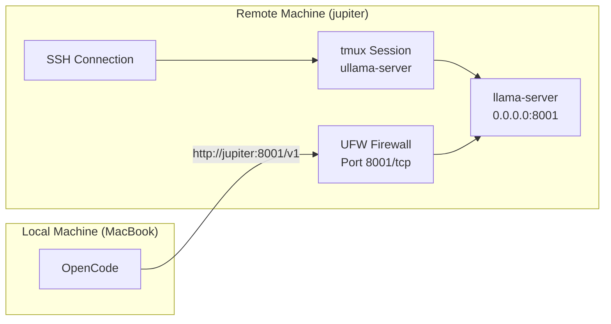

# Ullama Scripts

Infrastructure-as-Code for managing and orchestrating local Large Language Models using `llama-server`.

## Architecture: Router Mode

The project has transitioned to a **Router Mode** architecture. Instead of managing dozens of individual shell scripts, a single unified server manages model lifecycle, routing, and configuration through **Presets**.

### Key Benefits
- **Dynamic Switching:** Switch models via the API without restarting the server.
- **Optimized Presets:** Each model has its own tuned hardware settings (VRAM offload, context size, etc.) in a centralized configuration.
- **Resource Management:** Automatic LRU (Least Recently Used) eviction keeps memory usage within limits.

## Directory Structure

```
scripts/
├── run-server.sh            # Unified server entry point (Router Mode)
├── presets.ini              # Model configurations (Linux)
├── macos-presets.ini        # Model configurations (macOS)
├── update_llama_cpp.sh      # Utility: Update and build llama.cpp
├── update_agent_context.sh  # Utility: Generate hardware context (HOST_ENV.md)
└── install-docker.sh        # Utility: Install Docker with GPU support
```

## Usage

### Starting the Server

```bash
./scripts/run-server.sh
```

The server detects your operating system and loads the appropriate preset file. By default, it listens on **Port 8001**.

### Interacting with Models

The server provides an OpenAI-compatible API. To use a specific model, specify its alias in your request:

```bash
curl http://localhost:8001/v1/chat/completions \
  -H "Content-Type: application/json" \
  -d '{
    "model": "unsloth/Qwen3.5-122B-A10B",
    "messages": [{"role": "user", "content": "Explain router mode in llama.cpp"}]
  }'
```

### Listing Available Models

To see all models configured in your presets:

```bash
curl http://localhost:8001/v1/models | jq .
```

## Configuration (Presets)

Model-specific settings are stored in `scripts/presets.ini` (or `macos-presets.ini`).

### Adding a New Model
1. Open `scripts/presets.ini`.
2. Add a new section with the model alias:
   ```ini
   [my-new-model]
   hf = repo/name:quantization
   ctx-size = 32768
   temp = 0.7
   ```
3. The server will automatically discover this new model without a restart.

### Global Defaults
The `[DEFAULT]` section defines settings shared by all models unless overridden:
- `threads`: 8 (Pinned to physical cores 0-7 via `taskset` on Linux)
- `flash-attn`: on
- `cache-type-k/v`: q8_0
- `port`: 8001

## Platform Notes

### Linux
- Uses `taskset -c 0-7` to bind the server to the first 8 physical cores, optimal for systems with 3D V-Cache (e.g., Ryzen 7950X3D).
- Expects NVIDIA Container Toolkit for GPU acceleration.

### macOS
- Uses `macos-presets.ini` with `n-gpu-layers = 999` to ensure full offload to Apple Silicon (Metal).
- Automatically adjusts thread counts and memory locking (`mlock`) for better performance on macOS.

## Utilities

- **`update_llama_cpp.sh`**: Fetches the latest source and rebuilds with CUDA support.
- **`update_agent_context.sh`**: Refreshes `HOST_ENV.md` with current system specs.
- **`install-docker.sh`**: One-liner setup for Docker and NVIDIA drivers on CachyOS/Arch.
- **`start-server-tmux.sh`**: SSH + tmux remote server access (temporary solution).

## Advanced: Remote Server Access (Temporary Solution)

> **Note:** This SSH + tmux workflow is a temporary solution until the systemd service implementation is complete. See [`docs/specs/systemd-plan.md`](docs/specs/systemd-plan.md) for the permanent solution.

### Use Case

Run the llama-server on a remote machine (e.g., `jupiter`) while accessing it from your local machine via OpenCode or Open WebUI.

### Prerequisites

- SSH access to the remote machine
- tmux installed on the remote machine
- Port 8001 open in firewall (script handles this automatically)

### Architecture



### Workflow

#### Starting the Server

```bash
# SSH into remote machine
ssh zoo@jupiter

# Navigate to scripts directory
cd /home/zoo/workspace/machine-learning/ullama/scripts

# Run the helper script
./start-server-tmux.sh

# Script will:
# - Check if tmux session already exists
# - Open port 8001 in firewall (if needed)
# - Start server in detached tmux session
# - Display reconnection instructions

# Detach from tmux session
# Press Ctrl+b, then d

# Exit SSH
exit
```

#### Configuring OpenCode on Local Machine

Set the API endpoint to:
```
http://jupiter:8001/v1
```

Or use the IP address:
```
http://<jupiter-ip>:8001/v1
```

#### Reconnecting to Check Logs

```bash
ssh zoo@jupiter
tmux attach -t ullama-server

# When done, detach again
# Press Ctrl+b, then d
```

#### Stopping the Server

```bash
ssh zoo@jupiter
tmux kill-session -t ullama-server
```

### Troubleshooting

| Issue | Solution |
|-------|----------|
| Connection refused from local machine | Verify port 8001 is open: `sudo ufw status \| grep 8001` |
| tmux session not found | Start a new session with `./start-server-tmux.sh` |
| Server not responding | Reattach to session: `tmux attach -t ullama-server` |
| Firewall blocks connection | Run `sudo ufw allow 8001/tcp` manually |

### Comparison: tmux vs systemd

| Feature | tmux (Current) | systemd (Planned) |
|---------|----------------|-------------------|
| Setup | Manual SSH + tmux | One-time install |
| Auto-start | No | Yes (on boot) |
| Auto-restart | No | Yes (on failure) |
| Log rotation | Manual | Automatic (logrotate) |
| Service management | tmux commands | systemctl commands |
| Remote access | Requires SSH session | Direct API access |

See [`docs/specs/systemd-plan.md`](docs/specs/systemd-plan.md) for implementation details.
